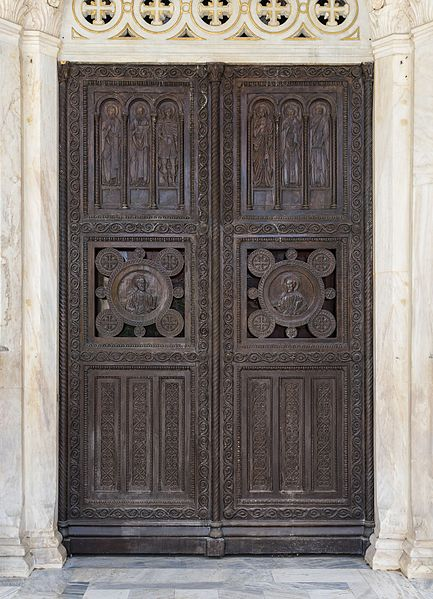
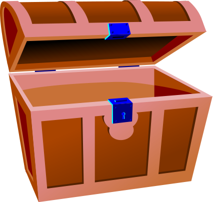
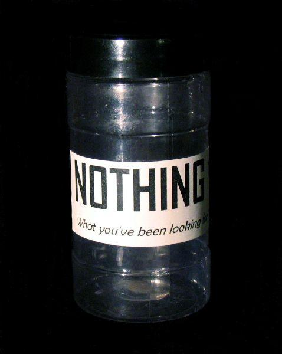

# Treasure hunt (Avancerad)

1. Skapa en sida med tre dörrar

1. När användaren håller musen över en dörr så snurrar den runt och visar bilden bakom som antingen är en skatt

eller inget

## Tips
För att snurra på ett element kan du använda css egenskapen [rotateY](https://developer.mozilla.org/en-US/docs/Web/CSS/transform-function/rotateY) och låta psuedo klassen "hover" avgöra när elementet ska roteras

Animerad rotation - https://www.youtube.com/watch?v=OV8MVmtgmoY
